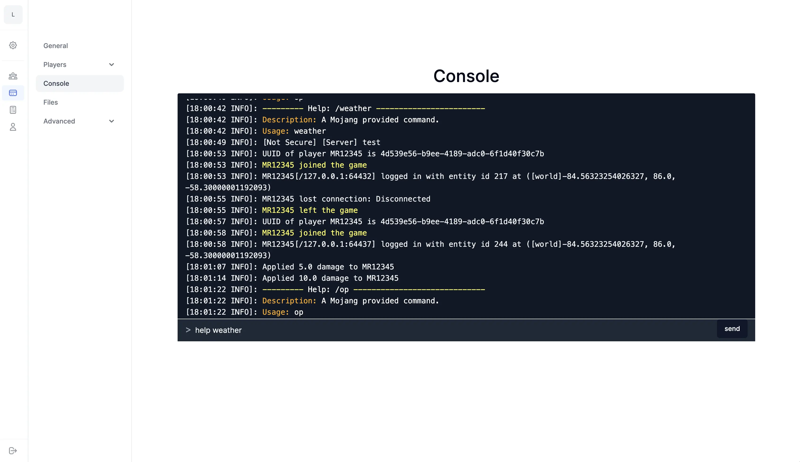
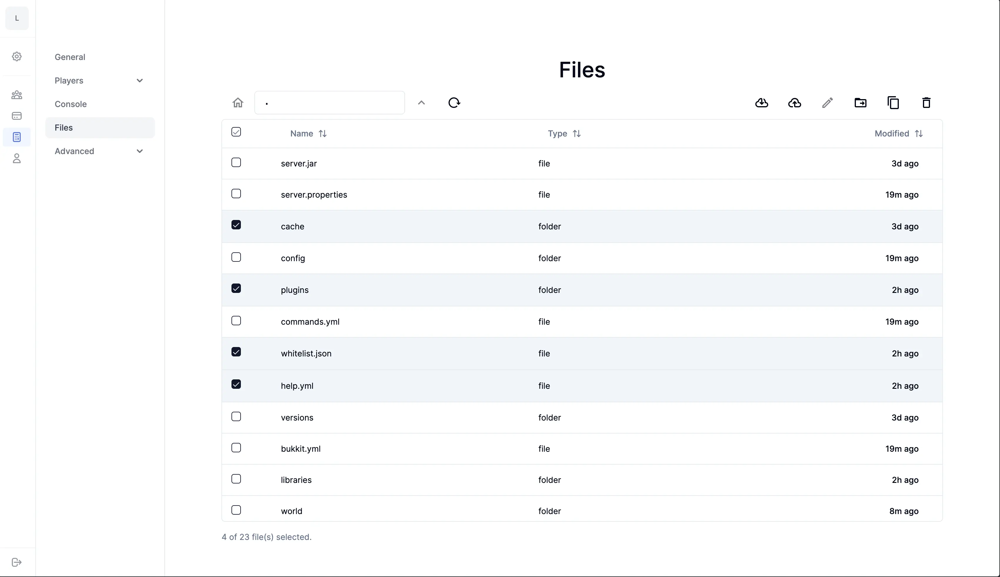
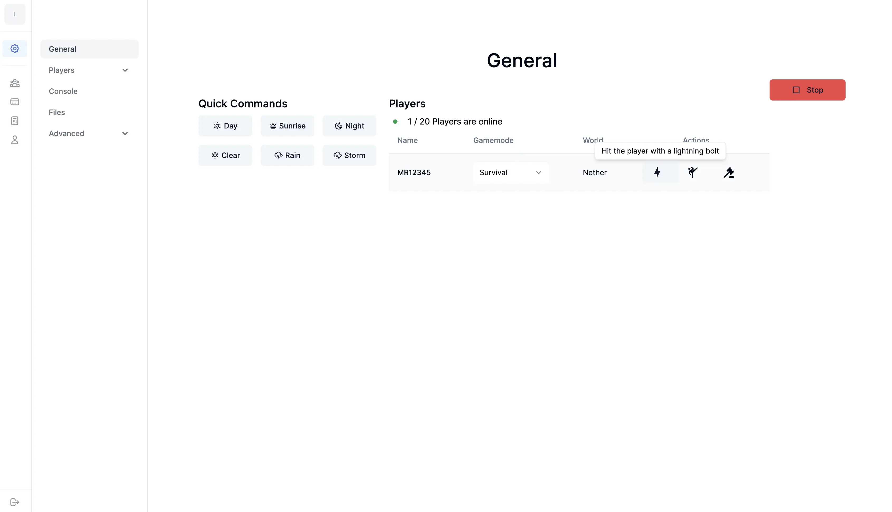

# MC Dash
A free & opensource Minecraft Dashboard to control your server





## Features
- [x] Live Console
        To see console output live and execute commands
- [x] File Explorer
        To delete, upload, download, etc files e.g. plugins
- [x] Dashboard
        With some general information and quick commands
- [x] Setup Wizard
        Here you can select a server and a version and agree to the eula.txt

## TO-DO
- [ ] Setup Script
- [ ] Docker Container
- [ ] Backend Cors Settings, if you dont want use *
- [ ] File Editor
- [ ] Explorer Feature: Duplicate, Download, Move
- [ ] Dashboard: Get World, Get Gamemode


# Setup

## Prerequirements
- Java JRE (for minecraft)
- git

## Development
Visit the `dash/.env` file and change the token, websocket port there

For Development you need the have
- rust
- nodejs

---

```sh
cd dash
cargo run
```
will run the Websocket / API server

```sh
pnpm install
pnpm run dev
```
will run the frontend on http://localhost:3000/

## Deployment

#### Build the Backend / Server
This is not optimal currently and I plan in the further future if there are some people actually using this (open an issue if you do :D) to make 
a script to setup this and docker containers (or at least the Dockerfile & docker compose file)

**Config**
Visit the `dash/.env` file and change the token, websocket port there

**Build**
Build the Backend with 
```sh
# cd dash (if you are not in the directory of the backend)
cargo build --release
cp target/release/dash dash.bin
chmod +x dash.bin 
```

Build the Frontend with
```sh
# in the project directory 
pnpm install
pnpm run build
pnpm run start
```

> now the backend is running on localhost and the frontend too 

**Setup a Reverse Proxy**
I recommend the Docker Container _Nginx Proxy Manager_

than configure it to let your domain e.g. the www, @ record (with https) to redirect to localhost:3000
and another record e.g. api to redirect to localhost:{your port for the backend e.g. 8778, see the dash/.env file}, also with https


Visit the `.env.local` file and the api url to the public adress you run the server on e.g. (https://api.{your_domain}/...)

**Tmux Sessions**
open a new tmux session (`tmux`)

_Session 1_
```sh
cd dash
./dash.bin
```

(press _ctrl + b_ to detach)

_Session 2_
```sh
pnpm run start
```

(again detach)

> Now you should be alow to visit the dashboard on your domain :)


#### Questions? 

Please open an issue if you have any questions, im glad to help you :D