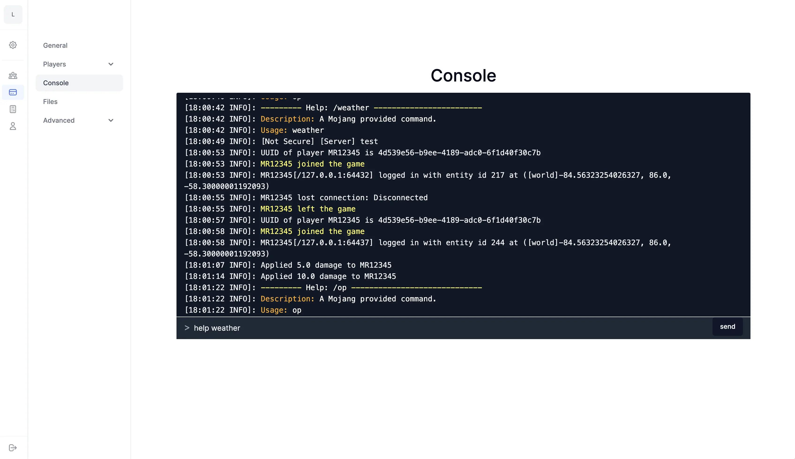

# 🛠️ MC Dash: Modern Minecraft Server Dashboard

MC Dash is a powerful, free, and open-source dashboard designed to give you total control over your Minecraft server. Built with a high-performance Rust backend and a modern Next.js frontend, it provides a seamless experience for server administrators.

---

## 🌟 Key Features

| Feature              | Description                                                                                               |
| :------------------- | :-------------------------------------------------------------------------------------------------------- |
| **🚀 Live Console**  | Real-time console output with ANSI color support and command execution.                                   |
| **📁 File Explorer** | Manage your plugins, worlds, and configs directly from the browser (Upload, Download, Delete).            |
| **📊 Dashboard**     | At-a-glance server status, resource usage, and quick-action buttons.                                      |
| **🧙 Setup Wizard**  | Effortless server installation. Select PaperMC or custom versions, and handle EULA agreements in seconds. |

### Preview


_The sleek, dark-themed terminal for real-time log monitoring._

---

## 📋 Prerequisites

Before you begin, ensure you have the following installed on your machine:

- **Java JRE/JDK** (Required to actually run the Minecraft server)
- **Rust & Cargo** (For the high-performance API server)
- **Node.js & pnpm** (For the Next.js frontend)
- **Git** (To clone the repository)

---

## 🚀 Quick Start (One-Click Setup)

We've simplified the deployment process. Use our automated script to get everything running in one command:

```bash
# Clone the repository
git clone https://github.com/your-username/mc_dash.git
cd mc_dash

# Make the script executable and run it
chmod +x run.sh
./run.sh
```

The script handles dependency installation, backend compilation, frontend building, and starts both services simultaneously. Press `Ctrl+C` to stop both servers safely.

---

## 🛠️ Manual Configuration & Development

### 1. Backend Configuration

Navigate to the `dash/` directory. Create or edit the `.env` file to set your secure token and port:

```env
# dash/.env
TOKEN=your_secure_access_token
PORT=8778
```

### 2. Frontend Configuration

Edit `.env.local` in the root directory to point to your backend:

```env
# .env.local
NEXT_PUBLIC_API_URL=http://localhost:8778
NEXT_PUBLIC_WS_URL=ws://localhost:8778/ws
```

### Development Mode

Run the backend and frontend separately to see changes in real-time:

**Backend:**

```bash
cd dash
cargo run
```

**Frontend:**

```bash
pnpm install
pnpm run dev # Dashboard available at http://localhost:3000
```

---

## 🌐 Production Deployment

### Manual Build

If you prefer to build the binaries manually:

**Build Backend:**

```bash
cd dash
cargo build --release
cp target/release/dash ./dash.bin
```

**Build Frontend:**

```bash
pnpm install
pnpm run build
```

### Reverse Proxy (Recommended)

For public access, we recommend using **Nginx Proxy Manager**.

1. **Frontend Proxy:** Point `your-domain.com` to `localhost:3000`.
2. **Backend/API Proxy:** Point `api.your-domain.com` to `localhost:8778`. Ensure **Websocket Support** is enabled in Nginx settings.

---

## 🛤️ Roadmap (To-Do)

- [ ] **Dockerization:** Full Docker & Docker-Compose support for one-command cloud deployment.
- [ ] **Advanced File Editor:** Edit config files and scripts directly in the browser with syntax highlighting.
- [ ] **Enhanced Explorer:** Support for Duplicating, Moving, and recursive downloading.
- [ ] **World Management:** Direct access to world settings and gamemode controls.
- [ ] **Security Hardening:** Implementing robust auth and fixing known vulnerabilities.

---

## 🤝 Contributing & Support

We welcome contributions! If you have ideas, bug reports, or questions:

1. Open an **Issue** to discuss your ideas.
2. Submit a **Pull Request** for fixes or new features.

**Questions?** Feel free to open an issue—I'm happy to help you get your dashboard up and running! :D
