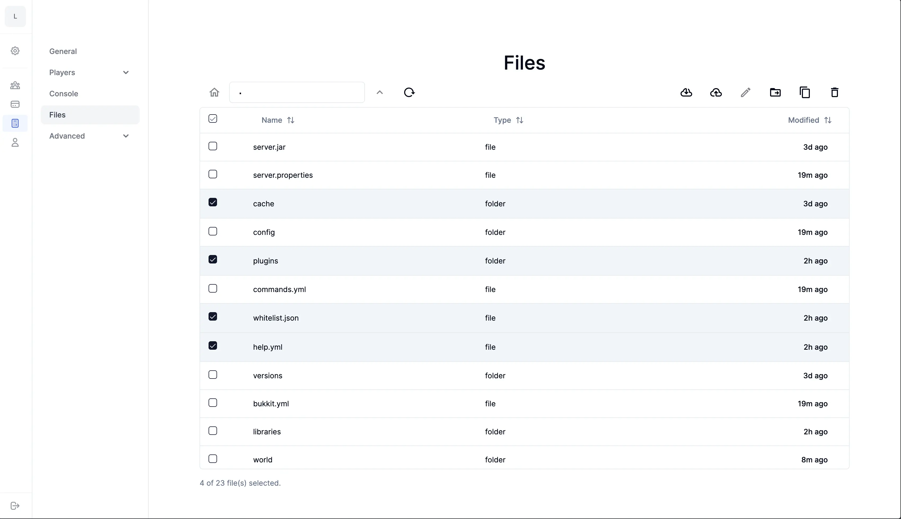
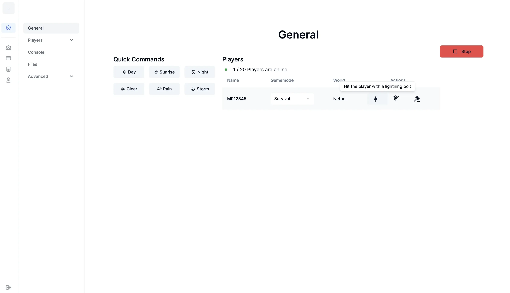

# NOT ACTIVELY MAINTAINED CURRENTLY

# THERE ARE KNOWN SECURITY VULNERABILITIES AFFECTING THIS PROJECT

# MC Dash

A free & opensource Minecraft Dashboard to control your server





## Features

- [x] Live Console
      To see console output live and execute commands
- [x] File Explorer
      To delete, upload, download, etc files e.g. plugins
- [x] Dashboard
      With some general information and quick commands
- [x] Setup Wizard
      Here you can select a server and a version and agree to the eula.txt

## TO-DO

- [ ] Setup Script
- [ ] Docker Container
- [ ] Backend Cors Settings, if you dont want use \*
- [ ] File Editor
- [ ] Explorer Feature: Duplicate, Download, Move
- [ ] Dashboard: Get World, Get Gamemode

# Setup

## Prerequirements

- Java JRE (for minecraft)
- git
- rust (cargo)
- nodejs (pnpm)

## Development

Visit the `dash/.env` file and change the token, websocket port there.

For Development you need to have:

- rust
- nodejs

---

```sh
cd dash
cargo run
```

will run the Websocket / API server

```sh
pnpm install
pnpm run dev
```

will run the frontend on http://localhost:3000/

## Deployment

**Configuration**

Before deploying, make sure to configure the application:

1.  Visit the `dash/.env` file and change the token and websocket port.
2.  Visit the `.env.local` file and set the API URL to the public address you run the server on (e.g., `https://api.{your_domain}/...`).

### Automatic Deployment (Recommended)

You can use the included `run.sh` script to automatically build both the backend and frontend, and start them together.

```sh
# in the project directory
chmod +x run.sh
./run.sh
```

This script will:

1.  Build the Rust backend in release mode.
2.  Install frontend dependencies and build the Next.js application.
3.  Start both the backend server and the frontend server.

To stop the servers, simply press `Ctrl+C`.

### Manual Deployment

If you prefer to build and run the services manually:

#### 1. Build the Backend / Server

```sh
cd dash
cargo build --release
cp target/release/dash dash.bin
chmod +x dash.bin
```

#### 2. Build the Frontend

```sh
# in the project directory root
pnpm install
pnpm run build
```

#### 3. Run the Services

You will need to run both the backend binary and the frontend server. You can use `tmux` or similar tools to keep them running.

_Session 1 (Backend)_

```sh
cd dash
./dash.bin
```

_Session 2 (Frontend)_

```sh
pnpm run start
```

### Setup a Reverse Proxy

I recommend the Docker Container _Nginx Proxy Manager_.

Configure it to:

1.  Redirect your domain (e.g., `www`, `@`) to `localhost:3000` (Frontend).
2.  Redirect your API subdomain (e.g., `api`) to `localhost:8778` (Backend - check `dash/.env` for the port).

#### Questions?

Please open an issue if you have any questions, im glad to help you :D
